# Hybrid Encryptor
This project is a Hybrid encryptor which utilizes Asymetric and Symetric encryption to encrypt a file between two parties.
All parameters are passed to the program via the config file. You can see examples of config files in the next section.
## Running examples
Running the program is very simple. You can use the following command lines to either encrypt or decrypt the files:
```cmd
java -jar .\encryptor.jar e .\encryption.properties
java -jar .\encryptor.jar d .\decryption.properties
```
## Config files
The program requires a config file which contains all the parameters for encryption and decryption.
### Encryption side
The Encryption program receives a config file. Here is an example of one:
```ini
inputFile=plaintext.txt
outputFile=output.txt
decryptedOutputFile=decrypted.txt
AsymetricAlgorithm=RSA
SymetricAlgorithm=AES/CBC/PKCS5Padding
HashAlgorithm=SHA-256
KeyStoreType=JKS
outConfigFile=decryption.properties
keyLength=256

sender.keyStoreFile=senderkeystore.jks
sender.KeyStorePassword=senderpassword
sender.keyAlias=senderkey
sender.certificateAlias=sendercert

receiver.keyStoreFile=receiverkeystore.jks
receiver.KeyStorePassword=receiverpassword
receiver.keyAlias=receiverkey
receiver.certificateAlias=receivercert
```
If one would like, he could add a crypto Provider by adding the following line to the properties file:
```ini
cryptoProvider=MyCryptoProvider 
```
### Decryption side
The encryption program outputs the config file to `outConfigFile`. An example config file is as follows:
```ini
receiver.encryptionkeyAlias=receiverkey
secretKey=jyqLOCtGxpjNbau7r16xWaWJckxpRp6sjzlOAMOcHsNiSopouj0DzhxH8adDQJo1op2gQqva3uAHgFXiGQDipa56XKFKU1WC+1rSaVihI4I1tY68HDOok2J8B78bbs2qC3x4NaXBRXf4uLPfp5jDp4bC1vfykTDr3527mHEudGdy7nZm0uzGxQ3cUwI236otk8nPnqRzWLHdzFjNZWbfhWAKfdJdPy9EfQumyx1vHn+KbO97J5mNkDKR8vGwiw78cdOrm4WKXJ1TXlKvIb50Twn8zPZnqWtPVKfNO4DjnJTTCaopQe9zHKP5GlYvfBVnrCEw5UO/nfAvmQuLQw14gA\=\=
digitalSignature=h5U2O2L3+cxgY9GJSheaxbolEksB8F5OZSab9CHQZ1J3jqPq5IQvFNL4fHUZrOXYWRay36fr38P1+SGH1XaMwOlZ2LS8Q1T+HyfxqKLh0HzpouZJoMqHPqwY03kgO44BHQjN/5xcD8znAc2yPCNhlM4+v/BM5/fgy0zZCNzMj0mScdkMahtewbxgeWYJ7KDyCGqjJuSe1g0hg16stAnKYsZ6Exl591FgmrxRxbgDMCRTCXDUMkH8OsGPBKtmR8e5kwsLRuqS8uhhAFL67ia6/PElHC84+qsNoQ2KaL1OYcFhh82ejonP2lc7WXqvE9ZNkXNTkS2w5P6f88YrTIebcQ\=\=
receiver.keyStorePassword=receiverpassword
inputFile=output.txt
outputFile=decrypted.txt
AsymetricAlgorithm=RSA
KeyStoreType=JKS
sender.certificateAlias=sendercert
SymetricAlgorithm=AES
receiver.keyStoreFile=receiverkeystore.jks
HashAlgorithm=SHA-256
```

## Creating the key store
In order to create the sender and receiver keystores, run the following commands:
```sh
echo Creating keys and certificates
keytool -genkeypair -keyalg RSA -keysize 2048 -alias senderkey -keystore senderkeystore.jks -storepass senderpassword -keypass senderpassword -storetype JKS -dname "CN=Sender, OU=My Org, O=My Org, L=My City, S=My State, C=US"
keytool -genkeypair -keyalg RSA -keysize 2048 -alias receiverkey -keystore receiverkeystore.jks -storepass receiverpassword -keypass receiverpassword  -storetype JKS -dname "CN=Receiver, OU=My Org, O=My Org, L=My City, S=My State, C=US"
echo Exporting certificates
keytool -exportcert -alias senderkey -keystore senderkeystore.jks -file sendercertificate.crt -storepass senderpassword
keytool -exportcert -alias receiverkey -keystore receiverkeystore.jks -file receivercertificate.crt -storepass receiverpassword
echo Importing certificates
keytool -importcert -noprompt -alias receivercert -file receivercertificate.crt -keystore senderkeystore.jks -storepass senderpassword
keytool -importcert -noprompt -alias sendercert -file sendercertificate.crt -keystore receiverkeystore.jks -storepass receiverpassword
```

## Class diagrams

```mermaid
classDiagram
      class HybridEncryptor{
          -EncryptionPropertiesParser properties
          -void encryptFile(SecretKey secretKey) 
          -SecretKey generateSecretKey()
          -void generateDecryptionConfig(SecretKey secretKey)
          -String encryptSecretKey(SecretKey secretKey)
          -byte[] signFile()
          +HybridEncryptor(EncryptionPropertiesParser properties)
          +void run()
      }
      class HybridDecryptor{
          -DecryptionPropertiesParser properties
          -MessageDigest calculateHash()
          -boolean verifySignature()
          -void decryptFile(SecretKey secretKey)
          -SecretKey decryptSecretKey()
          +HybridDecryptor(DecryptionPropertiesParser properties)
          +void run()
      }
      class Main{
          +void decrypt()
          +void encrypt()
          +void main(String[] args) 
      }
      class EncryptionPropertiesParser {
          - EncryptionPropertiesParser(String filePath)
          - String getOutputFile()
          - String getInputFile()
          - String getOutConfigFile()
          - Key getPrivateKey()
          - Key getReceiverPublicKey()
          - Certificate getReceiverCertificate()
          - String getAsymetricAlgorithm()
          - String getSymetricAlgorithm()
          - String getHashAlgorithm()
          - Properties getDecryptionConfig()
      }
      class DecryptionPropertiesParser {
          - DecryptionPropertiesParser(String filePath)
          - String getSecretKey()
          - String getDigitalSignature()
          - String getOutputFile()
          - String getInputFile()
          - Key getPrivateKey()
          - Key getSenderPublicKey()
          - Certificate getSenderCertificate()
          - String getAsymetricAlgorithm()
          - String getSymetricAlgorithm()
          - String getHashAlgorithm()
      }
```


## Algorithms & API
In our configuration, we selected 3 algorithms - RSA, AES and SHA-256
- RSA is the most common algorithm for asymmetric encryption and decryption. It runs very fast and is considered statistically secure (as long as a big enough key is chosen and no quantum computer is used). It is very common and of course supported by the Java Crypto API.
- AES was used for the same reasons as RSA - it is probably the most commonly used algorithm for symmetric encryption and decryption. It also runs very fast and is widely considered secure. Like RSA, it is supported by the Java Crypto API.
- SHA-256 is a very common algorithm for hashing - it is considered much more secure than SHA-1 or MD4. We delibirated between this algorithm and MD5, both are very hard to find collisions for, and we randomly chose SHA-256. It is supported by the Java Security MessageDigest API which works perfectly for us.

We used the following Java Crypto API:
- Cipher.getInstance and then cipher.init for creating initialized Cipher objects used for symmetric and asymmetric encryption and decryption. The mode is chosen according to the given parameters, such as Crypto.DECRYPT_MODE/Crypto.ENCRYPT_MODE
- CipherOutputStream for creating a stream which encrypted/decrypted data can be written to (using the object we created in the previous point). The encrypted data is written using write.
- cipher.doFinal which finalizes the encryption/decryption of the cipher object obtained by getInstance
- KeyGenerator.getInstance for creating a KeyGenerator object which we can use to generate a symmetric key.
- keyGenerator.init, keyGenerator.generateKey for the actual generation of the key using the object.
- SecretKeySpec constructor in order to create a new SecretKey (for the symmetric secret key that was decrypted using the asymmetric private key).


## Example of a successful run
The following run was done on the attached plaintext.txt with the attached encryption.properties. The command line was:
    java -jar .\encryptor.jar e .\encryption.properties
The output configuration was in decryption.properties and the encrypted file is in encrypted.txt. The following output is printed to the console:
    Encrypting!
    Encrypting file: plaintext.txt
    Output file: encrypted.txt
    Writing decryption configuration to file: decryption.properties
    Done!

The decryption program was run on the generated configuration and the generated encrypted file. The command line was:
    java -jar .\encryptor.jar d .\decryption.properties
The output decrypted file in the attached decrypted.txt file. The following output is printed to the console:
    Decrypting!
    Loading Decryption Config from.\decryption.properties
    Verifying signature...
    Signature verified!
    Decrypting file: encrypted.txt
    Output file: decrypted.txt
    Done!